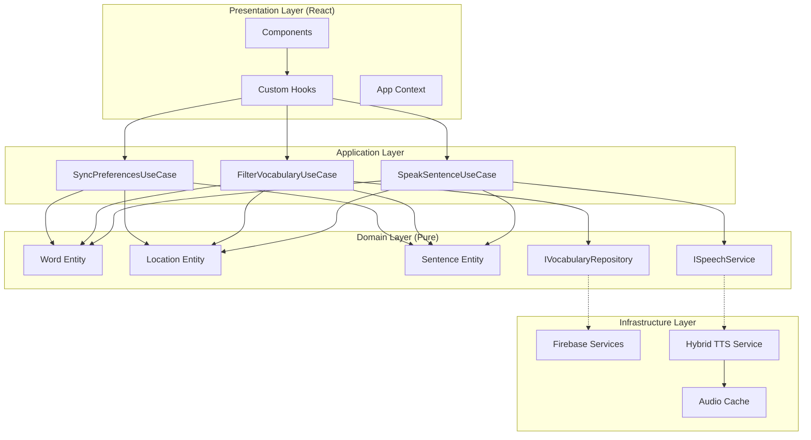
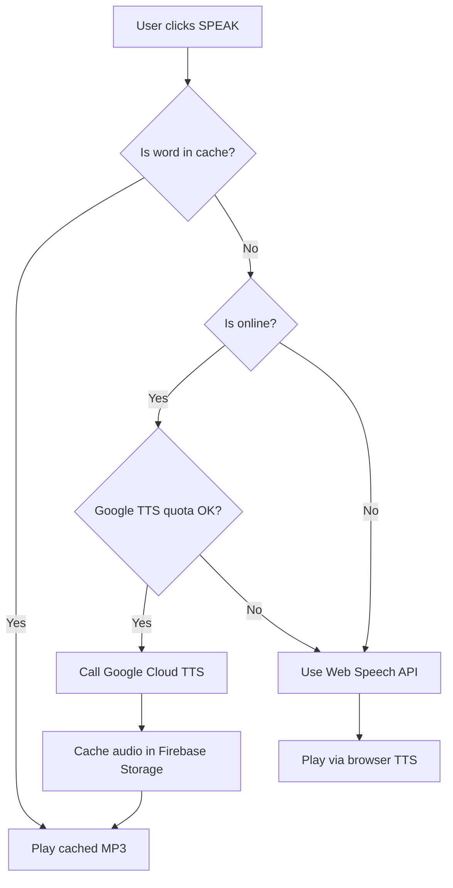

# HablaFácil - Spanish AAC Picture Communication Board

A web-based AAC app featuring ~300 core Spanish vocabulary words, categorized by location contexts, with cloud database sync and natural Spanish voice output.

---

## User Review Required

> [!IMPORTANT]
> **Firebase Setup**: You'll need to create a Firebase project at [console.firebase.google.com](https://console.firebase.google.com). I can guide you through this during setup.

> [!IMPORTANT]
> **Google Cloud TTS API Key**: For the best voice quality, you'll need a Google Cloud API key with Text-to-Speech enabled. Free tier covers 1M characters/month.

---

## Tech Stack (Finalized)

| Category | Technology | Purpose |
|----------|------------|---------|
| **Framework** | React 18 | UI components |
| **Language** | TypeScript | Type safety, better DX |
| **Build Tool** | Vite | Fast dev server & builds |
| **Styling** | TailwindCSS | Responsive, accessible utilities |
| **Cloud DB** | Firebase Firestore | Real-time sync, preferences |
| **File Storage** | Firebase Storage | Symbols, cached audio |
| **Auth** | Firebase Auth | Caregiver accounts (optional) |
| **Primary TTS** | Google Cloud TTS | Natural Spanish neural voices |
| **Fallback TTS** | Web Speech API | Offline/quota exceeded |
| **Testing** | Vitest | Unit tests |

---

## Architecture Overview (Clean Architecture)



---

## Project Structure

```
src/
├── domain/                          # Business logic (no dependencies)
│   ├── entities/
│   │   ├── Word.ts                  # Word entity with properties
│   │   ├── Location.ts              # Location entity
│   │   └── Sentence.ts              # Sentence builder entity
│   ├── repositories/
│   │   ├── IVocabularyRepository.ts
│   │   └── IUserPreferencesRepository.ts
│   └── services/
│       └── ISpeechService.ts        # TTS interface

├── application/                     # Use cases
│   └── useCases/
│       ├── SpeakSentenceUseCase.ts
│       ├── FilterVocabularyUseCase.ts
│       └── SyncPreferencesUseCase.ts

├── infrastructure/                  # External implementations
│   ├── firebase/
│   │   ├── firebaseConfig.ts
│   │   ├── FirebaseVocabularyRepository.ts
│   │   └── FirebaseStorageService.ts
│   └── speech/
│       ├── HybridSpeechService.ts   # Main TTS orchestrator
│       ├── GoogleCloudTTSProvider.ts
│       ├── WebSpeechProvider.ts
│       └── AudioCacheService.ts     # Cached audio management

├── presentation/                    # React UI
│   ├── components/
│   │   ├── SymbolGrid/
│   │   ├── SentenceBuilder/
│   │   ├── LocationSelector/
│   │   └── ui/                      # Reusable UI components
│   ├── hooks/
│   │   ├── useVocabulary.ts
│   │   ├── useSpeech.ts
│   │   └── useLocations.ts
│   ├── context/
│   │   └── AppContext.tsx
│   └── pages/
│       └── HomePage.tsx

├── data/                            # Static vocabulary data
│   ├── vocabulary.json              # 300 core Spanish words
│   └── locations.json               # Location definitions

├── App.tsx
└── main.tsx
```

---

## Hybrid TTS Architecture



### TTS Strategy:

| Scenario | Provider | Quality |
|----------|----------|---------|
| **Core 300 words** | Pre-cached MP3s (Firebase Storage) | ⭐⭐⭐⭐⭐ |
| **Custom sentences (online)** | Google Cloud TTS Neural | ⭐⭐⭐⭐⭐ |
| **Offline / Quota exceeded** | Web Speech API fallback | ⭐⭐⭐ |

---

## Proposed Files

### Core Setup

| File | Purpose |
|------|---------|
| [NEW] `package.json` | React + TypeScript + Vite + TailwindCSS + Firebase |
| [NEW] `tailwind.config.js` | TailwindCSS configuration |
| [NEW] `src/infrastructure/firebase/firebaseConfig.ts` | Firebase initialization |
| [NEW] `.env.example` | Environment variables template |

---

### Domain Layer

| File | Purpose |
|------|---------|
| [NEW] `src/domain/entities/Word.ts` | Word entity (spanish, english, category, locations, symbolUrl) |
| [NEW] `src/domain/entities/Location.ts` | Location entity (id, name, icon, color) |
| [NEW] `src/domain/entities/Sentence.ts` | Sentence with word array and speak method |
| [NEW] `src/domain/repositories/IVocabularyRepository.ts` | Repository interface |
| [NEW] `src/domain/services/ISpeechService.ts` | TTS service interface |

---

### Infrastructure Layer

| File | Purpose |
|------|---------|
| [NEW] `src/infrastructure/firebase/FirebaseVocabularyRepository.ts` | Firestore implementation |
| [NEW] `src/infrastructure/firebase/FirebaseStorageService.ts` | Storage for symbols/audio |
| [NEW] `src/infrastructure/speech/HybridSpeechService.ts` | TTS orchestrator |
| [NEW] `src/infrastructure/speech/GoogleCloudTTSProvider.ts` | Google Cloud TTS |
| [NEW] `src/infrastructure/speech/WebSpeechProvider.ts` | Browser fallback |
| [NEW] `src/infrastructure/speech/AudioCacheService.ts` | Audio caching logic |

---

### Presentation Layer

| File | Purpose |
|------|---------|
| [NEW] `src/presentation/components/SymbolGrid/SymbolGrid.tsx` | Main vocabulary grid |
| [NEW] `src/presentation/components/SymbolGrid/SymbolCard.tsx` | Individual word card |
| [NEW] `src/presentation/components/SentenceBuilder/SentenceBuilder.tsx` | Sentence display + speak |
| [NEW] `src/presentation/components/LocationSelector/LocationSelector.tsx` | Location tabs |
| [NEW] `src/presentation/hooks/useVocabulary.ts` | Vocabulary state management |
| [NEW] `src/presentation/hooks/useSpeech.ts` | TTS hook |
| [NEW] `src/presentation/context/AppContext.tsx` | Global app state |
| [NEW] `src/presentation/pages/HomePage.tsx` | Main page layout |

---

### Data Files

| File | Purpose |
|------|---------|
| [NEW] `src/data/vocabulary.json` | 300 Spanish core words |
| [NEW] `src/data/locations.json` | 6 location categories |

---

## Vocabulary Data Structure

```typescript
// Word entity
interface Word {
  id: string;
  spanish: string;           // "quiero"
  english: string;           // "I want"
  category: WordCategory;    // "verbos" | "sustantivos" | ...
  locations: string[];       // ["casa", "escuela", "all"]
  symbolUrl: string;         // Firebase Storage URL
  audioUrl?: string;         // Cached audio URL
  frequency: "high" | "medium" | "low";
}

// Location entity
interface Location {
  id: string;                // "casa"
  spanish: string;           // "Casa"
  english: string;           // "Home"
  icon: string;              // "🏠"
  color: string;             // "bg-amber-500"
}
```

---

## Locations (6 Categories)

| ID | Spanish | English | Icon |
|----|---------|---------|------|
| `casa` | Casa | Home | 🏠 |
| `escuela` | Escuela | School | 🏫 |
| `parque` | Parque | Park | 🌳 |
| `centro_comercial` | Centro Comercial | Mall | 🛒 |
| `hospital` | Hospital | Hospital | 🏥 |
| `restaurante` | Restaurante | Restaurant | 🍽️ |

---

## Verification Plan

### Automated Tests
```powershell
# Start dev server
npm run dev

# Run tests
npm run test

# Build for production
npm run build
```

### Browser Testing
1. Symbol grid displays correctly
2. Location switching filters vocabulary
3. Clicking symbols adds to sentence
4. Speak button plays natural Spanish audio
5. Offline mode falls back to Web Speech API
6. Responsive layout on tablet/mobile

### Manual Verification
1. Firebase sync works across devices
2. Spanish pronunciation is natural and clear
3. Large touch targets work on tablet
